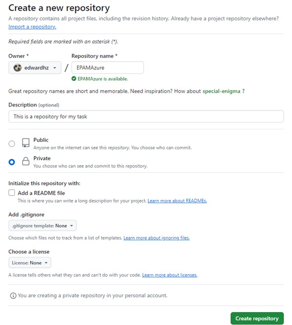
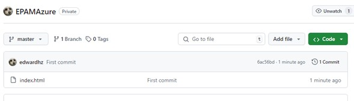
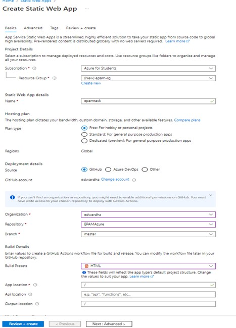
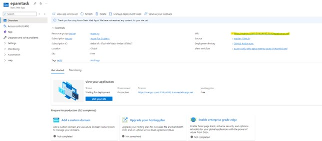

## Steps

1. Creating GitHub repository for the static web page.

   

2. Pushing the web page to the repository

   

4. I created the Static Web App resource from the Azure Portal. I used GitHub as the source, and since it was just an HTML website, I chose HTML for Build Presets option.

   

6. Once the resource was created, we can access the website using the URL that the resource provides.

   

8. When we access the website, it works fine. (Now, every time I push a change to the repository, the website will be updated)

   

 

